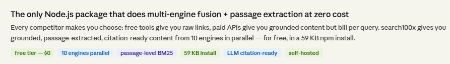
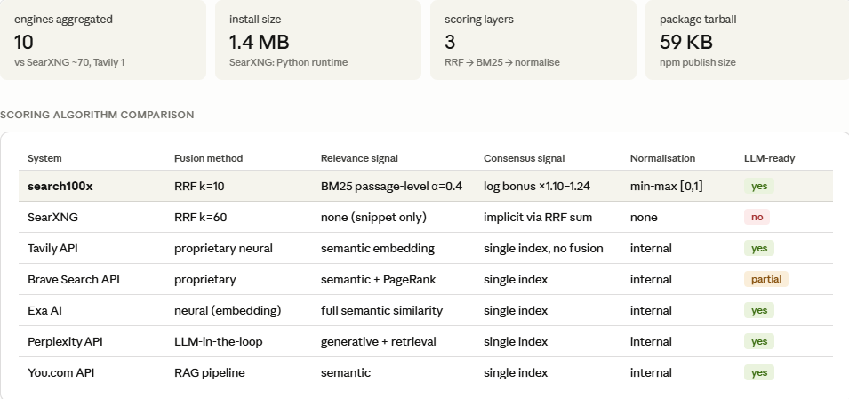
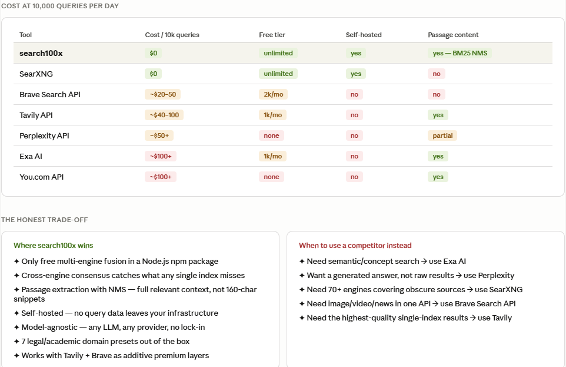
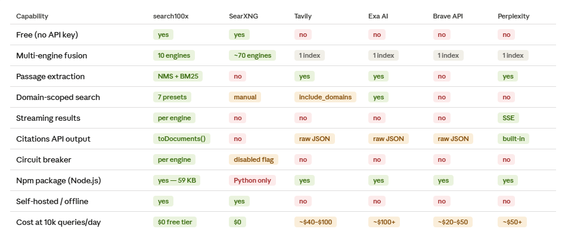
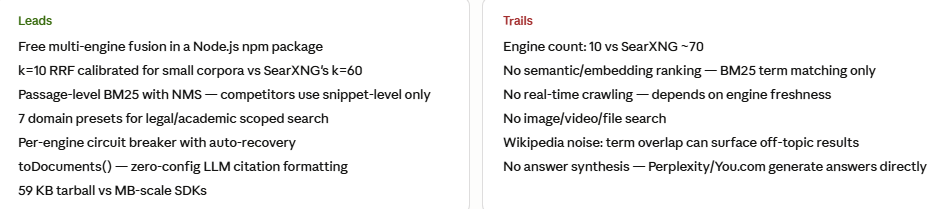

# search100x

**Multi-source web search for LLM grounding — works with any model provider.**

Aggregates results from DuckDuckGo, Bing, Mojeek, Google News, Bing News, Wikipedia, Brave, Tavily, Google Search, Marginalia, and Yep into a single ranked list using RRF + BM25 scoring. Extracts relevant page passages and formats them for any LLM's context window.

[](https://www.npmjs.com/package/search100x)
[](./LICENSE)
[](https://bundlephobia.com/package/search100x)





---

## How it compares







---

## Features

- **12 search engines in parallel** — free engines (no key needed) + optional premium APIs
- **SearXNG integration** — connect your own SearXNG instance to add ~70 sub-engines in a single call
- **4-factor cascade scoring** — RRF × authority × BM25 × recency, with presets for `news`, `legal`, and `academic`
- **Cross-engine + sub-engine consensus** — results confirmed by multiple engines (and SearXNG sub-engines) are boosted logarithmically
- **Content extraction** — fetches actual page text, splits into 200-word windows, returns highest-scoring passages relevant to the query
- **Cross-encoder re-ranking** — optional `rerank: true` uses ms-marco-MiniLM-L-6-v2 via ONNX for semantic reranking (no Python needed)
- **Citations-ready output** — `toDocuments()` formats results as structured documents with source URLs (works with Anthropic, OpenAI, Gemini, Sarvam, any LLM)
- **Domain presets** — `india-legal`, `us-legal`, `uk-legal`, `eu-legal`, `academic`, and more
- **Streaming** — `searchStream()` async generator yields results as each engine completes
- **Plugin API** — register custom engines, disable built-ins, inspect circuit breaker state
- **HTTP API + CLI** — ships with an Express server and a `search100x` CLI command
- **Tiny install** — ~1.4 MB, one runtime dependency (`node-html-parser`)

---

## Install

```bash
npm install search100x
```

No API keys required for basic usage. Brave and Tavily keys unlock premium results.

---

## Quick start

```typescript
import { EnhancedSearch } from "search100x";

const s = new EnhancedSearch();
const res = await s.search("SC AI Committee Draft Regulations 2026");

console.log(res.results);
// [{ title, url, snippet, score, sources }, ...]
```

---

## Usage with LLM providers

### Anthropic Claude — with Citations API

The `toDocuments()` helper formats results into Claude's native document format.
Claude returns an answer with inline citations linked back to each source URL.

```typescript
import Anthropic from "@anthropic-ai/sdk";
import { EnhancedSearch, buildCitedQuery, DOMAIN_PRESETS } from "search100x";

const s = new EnhancedSearch();
const res = await s.search("Online Safety Act obligations for platforms", {
  scopedDomains: DOMAIN_PRESETS["uk-legal"],
  enrichContent: 5,   // fetch full relevant passages from top 5 pages
  limit: 10,
});

const anthropic = new Anthropic();
const msg = await anthropic.messages.create({
  model: "claude-sonnet-4-6",
  ...buildCitedQuery(res.results, "What are the key obligations for platforms under the Online Safety Act?"),
});

// msg.content contains the answer with inline citations
// Each citation includes the source URL from result.url
console.log(msg.content);
```

---

### OpenAI — GPT-4o / o1

Inject search results as grounding context in the system prompt.

```typescript
import OpenAI from "openai";
import { EnhancedSearch } from "search100x";

const s      = new EnhancedSearch();
const client = new OpenAI();

const query = "EU AI Act prohibited practices";
const res   = await s.search(query, { enrichContent: 5, limit: 8 });

// Format results as grounding context
const context = res.results
  .map((r, i) => `[${i + 1}] ${r.title}\nURL: ${r.url}\n${r.content ?? r.snippet}`)
  .join("\n\n---\n\n");

const completion = await client.chat.completions.create({
  model: "gpt-4o",
  messages: [
    {
      role: "system",
      content: `You are a helpful assistant. Answer using only the search results below.\n\n${context}`,
    },
    { role: "user", content: query },
  ],
});

console.log(completion.choices[0].message.content);
```

---

### Google Gemini

```typescript
import { GoogleGenerativeAI } from "@google/generative-ai";
import { EnhancedSearch } from "search100x";

const s      = new EnhancedSearch();
const genAI  = new GoogleGenerativeAI(process.env.GOOGLE_API_KEY!);
const model  = genAI.getGenerativeModel({ model: "gemini-1.5-pro" });

const query = "DPDP Act India compliance requirements";
const res   = await s.search(query, { enrichContent: 5, limit: 8 });

const context = res.results
  .map((r) => `Title: ${r.title}\nSource: ${r.url}\n${r.content ?? r.snippet}`)
  .join("\n\n---\n\n");

const result = await model.generateContent(
  `Using the following search results:\n\n${context}\n\nAnswer: ${query}`
);

console.log(result.response.text());
```

---

### Sarvam AI

[Sarvam AI](https://www.sarvam.ai/) is India's foundational AI model with strong support for Indian languages — Hindi, Tamil, Telugu, Kannada, Bengali, and more. Use `search100x` to ground Sarvam with live legal and news results from authoritative Indian sources.

```typescript
import { EnhancedSearch, DOMAIN_PRESETS } from "search100x";

const SARVAM_API_KEY = process.env.SARVAM_API_KEY!;
const s = new EnhancedSearch();

const res = await s.search("SC AI Committee Draft Regulations 2026", {
  scopedDomains: DOMAIN_PRESETS["india-legal"],
  enrichContent: 5,
  limit: 10,
});

const context = res.results
  .map((r, i) => `[${i + 1}] ${r.title}\nSource: ${r.url}\n${r.content ?? r.snippet}`)
  .join("\n\n---\n\n");

const response = await fetch("https://api.sarvam.ai/v1/chat/completions", {
  method: "POST",
  headers: {
    "Content-Type": "application/json",
    "api-subscription-key": SARVAM_API_KEY,
  },
  body: JSON.stringify({
    model: "sarvam-m",
    messages: [
      {
        role: "system",
        content: `You are a helpful legal assistant for Indian law. Use the search results below to answer.\n\n${context}`,
      },
      {
        role: "user",
        content: "What does the SC AI Committee Draft Regulations 2026 say about prohibited AI uses in courts?",
      },
    ],
  }),
});

const data = await response.json();
console.log(data.choices[0].message.content);
```

**Multilingual tip:** Sarvam handles Indian language queries natively. Pass a Hindi or Tamil query directly to `s.search()` — the engines will return relevant results and Sarvam will interpret them in the user's language.

```typescript
// Query in Hindi
const res = await s.search("न्यायालयों में एआई के उपयोग पर नियम 2026", {
  scopedDomains: DOMAIN_PRESETS["india-legal"],
  enrichContent: 3,
});
```

---

### OpenClaw

[OpenClaw](https://openclaw.in/) is an AI-powered legal research platform for Indian law. Use `search100x` to augment OpenClaw workflows with live web search results from authoritative Indian legal sources — Supreme Court judgments, ministry circulars, SEBI/RBI notices, and more.

```typescript
import { EnhancedSearch, DOMAIN_PRESETS, toDocuments } from "search100x";

const s = new EnhancedSearch();

// Search across Indian legal domains + case law repositories
const res = await s.search("Section 43A IT Act data protection liability", {
  scopedDomains: [
    ...DOMAIN_PRESETS["india-legal"],
    "indiankanoon.org",
    "main.sci.gov.in",
    "districts.ecourts.gov.in",
  ],
  enrichContent: 5,
  limit: 10,
});

// Format for LLM-backed legal analysis with citations
const docs = toDocuments(res.results);

// Each doc.context = source URL for citation
// Each doc.source.data = extracted relevant passage
// Pass to any LLM for legal reasoning with cited sources
console.log(`Found ${docs.length} cited sources for legal analysis`);

docs.forEach((d, i) => {
  console.log(`\n[${i + 1}] ${d.title}`);
  console.log(`    Source: ${d.context}`);
  console.log(`    Preview: ${d.source.data.slice(0, 150)}...`);
});

// Use with Claude for a cited legal answer
import Anthropic from "@anthropic-ai/sdk";
import { buildCitedQuery } from "search100x";

const anthropic = new Anthropic();
const msg = await anthropic.messages.create({
  model: "claude-sonnet-4-6",
  ...buildCitedQuery(
    res.results,
    "What is the liability of a body corporate under Section 43A for data protection failures?"
  ),
});
console.log(msg.content);
```

**Built-in `india-legal` preset covers:**

| Domain | Authority |
|---|---|
| `indiacode.nic.in` | Ministry of Law & Justice — full statute text |
| `main.sci.gov.in` | Supreme Court of India |
| `sebi.gov.in` | Securities and Exchange Board of India |
| `rbi.org.in` | Reserve Bank of India |
| `mca.gov.in` | Ministry of Corporate Affairs |
| `income-tax.india.gov.in` | Income Tax Department |
| `cbic.gov.in` | Central Board of Indirect Taxes |
| `legislative.gov.in` | Parliament of India — Bills & Acts |

---

### Hermes Agent (NousResearch)

[Hermes](https://huggingface.co/NousResearch) models (Hermes-3-Llama, Hermes-2-Pro) excel at agentic tool use and structured function calling. Use `search100x` as a tool in a Hermes agentic loop via Ollama, llama.cpp, or any OpenAI-compatible endpoint.

```typescript
import OpenAI from "openai"; // Hermes exposes an OpenAI-compatible API
import { EnhancedSearch, DOMAIN_PRESETS } from "search100x";

// Point to your local Hermes endpoint
const client = new OpenAI({
  baseURL: process.env.HERMES_BASE_URL ?? "http://localhost:11434/v1",
  apiKey:  "ollama",
});

const s = new EnhancedSearch();

// Define search100x as a callable tool for Hermes
const tools: OpenAI.Chat.ChatCompletionTool[] = [
  {
    type: "function",
    function: {
      name: "web_search",
      description: "Search the web for up-to-date information. Returns ranked results with source URLs and extracted content.",
      parameters: {
        type: "object",
        properties: {
          query: {
            type: "string",
            description: "The search query",
          },
          preset: {
            type: "string",
            enum: ["india-legal", "us-legal", "uk-legal", "eu-legal", "au-legal", "sg-legal", "academic"],
            description: "Optional domain preset to restrict search to authoritative sources",
          },
          limit: {
            type: "number",
            description: "Maximum number of results to return (default 10)",
          },
        },
        required: ["query"],
      },
    },
  },
];

// Agentic loop — Hermes decides when to call search and when to answer
const messages: OpenAI.Chat.ChatCompletionMessageParam[] = [
  {
    role: "system",
    content: "You are a legal research assistant. Use the web_search tool to find current information before answering.",
  },
  {
    role: "user",
    content: "What are the key rules in the SC AI Committee Draft Regulations 2026 for Indian courts?",
  },
];

while (true) {
  const resp = await client.chat.completions.create({
    model:       "hermes3",
    messages,
    tools,
    tool_choice: "auto",
  });

  const choice = resp.choices[0];
  messages.push(choice.message);

  if (choice.finish_reason !== "tool_calls") {
    console.log("\nFinal answer:\n", choice.message.content);
    break;
  }

  // Execute each tool call
  for (const call of choice.message.tool_calls ?? []) {
    const args = JSON.parse(call.function.arguments) as {
      query: string;
      preset?: string;
      limit?: number;
    };

    const res = await s.search(args.query, {
      scopedDomains: args.preset ? DOMAIN_PRESETS[args.preset as keyof typeof DOMAIN_PRESETS] : undefined,
      limit:         args.limit ?? 10,
      enrichContent: 5,
    });

    const toolResult = res.results
      .map((r, i) => `[${i + 1}] ${r.title}\nURL: ${r.url}\n${r.content ?? r.snippet}`)
      .join("\n\n---\n\n");

    messages.push({
      role:         "tool",
      tool_call_id: call.id,
      content:      toolResult,
    });

    console.log(`[tool] Searched: "${args.query}" → ${res.count} results in ${res.durationMs}ms`);
  }
}
```

**Running Hermes locally with Ollama:**

```bash
# Install Ollama — https://ollama.com
ollama pull nous-hermes2        # 7B, fast
ollama pull hermes3             # Llama 3.1 based, best tool use
ollama serve

# Run your agent
HERMES_BASE_URL=http://localhost:11434/v1 node agent.js
```

**Running on Together AI / Fireworks (hosted Hermes):**

```typescript
const client = new OpenAI({
  baseURL: "https://api.together.xyz/v1",
  apiKey:  process.env.TOGETHER_API_KEY!,
});
// model: "NousResearch/Hermes-3-Llama-3.1-70B"
```

---

### LangChain

Use `search100x` as a LangChain `Tool` inside any chain or ReAct agent.

```typescript
import { ChatOpenAI }    from "@langchain/openai";
import { AgentExecutor, createOpenAIFunctionsAgent } from "langchain/agents";
import { DynamicTool }   from "@langchain/core/tools";
import { ChatPromptTemplate } from "@langchain/core/prompts";
import { EnhancedSearch, DOMAIN_PRESETS } from "search100x";

const s = new EnhancedSearch();

const searchTool = new DynamicTool({
  name: "web_search",
  description: "Search the web for current information. Input is a search query string.",
  func: async (query: string) => {
    const res = await s.search(query, { enrichContent: 3, limit: 8 });
    return res.results
      .map((r) => `${r.title}\n${r.url}\n${r.content ?? r.snippet}`)
      .join("\n\n---\n\n");
  },
});

const llm    = new ChatOpenAI({ model: "gpt-4o", temperature: 0 });
const prompt = ChatPromptTemplate.fromMessages([
  ["system", "You are a helpful research assistant with access to web search."],
  ["placeholder", "{chat_history}"],
  ["human", "{input}"],
  ["placeholder", "{agent_scratchpad}"],
]);

const agent    = await createOpenAIFunctionsAgent({ llm, tools: [searchTool], prompt });
const executor = new AgentExecutor({ agent, tools: [searchTool], verbose: true });

const result = await executor.invoke({
  input: "What are the prohibited AI uses in Indian courts under the 2026 draft regulations?",
});
console.log(result.output);
```

---

### Vercel AI SDK

Use `search100x` as a `tool()` inside a streaming AI response.

```typescript
import { openai }                from "@ai-sdk/openai";
import { streamText, tool }      from "ai";
import { z }                     from "zod";
import { EnhancedSearch, DOMAIN_PRESETS } from "search100x";

const s = new EnhancedSearch();

const result = streamText({
  model: openai("gpt-4o"),
  tools: {
    webSearch: tool({
      description: "Search the web for current information",
      parameters: z.object({
        query:  z.string().describe("Search query"),
        preset: z.enum(["india-legal", "us-legal", "uk-legal", "eu-legal", "academic"])
                 .optional()
                 .describe("Domain preset for authoritative sources"),
      }),
      execute: async ({ query, preset }) => {
        const res = await s.search(query, {
          scopedDomains: preset ? DOMAIN_PRESETS[preset] : undefined,
          enrichContent: 3,
          limit: 8,
        });
        return res.results.map((r) => ({
          title:   r.title,
          url:     r.url,
          content: r.content ?? r.snippet,
          score:   r.score,
        }));
      },
    }),
  },
  prompt: "What are the SC AI Committee Draft Regulations 2026?",
});

for await (const chunk of result.textStream) {
  process.stdout.write(chunk);
}
```

---

## SearXNG integration

Connect your own SearXNG instance to route queries through ~70 additional sub-engines (Google, Bing, Brave, DuckDuckGo, Startpage, Qwant, Yahoo, and more) in a single parallel call. Results from SearXNG are merged with native engines using the same RRF + cascade scoring — sub-engines that agree on a result amplify its consensus bonus.

```typescript
import { EnhancedSearch } from "search100x";

const s = new EnhancedSearch({
  searxng: {
    baseUrl: "https://search100x.replit.app",
    token:   process.env.SEARXNG_TOKEN,      // if your instance requires auth
    engines: "google,bing,brave,ddg",         // optional: restrict sub-engines
  },
});

const res = await s.search("DPDP Act India 2025", {
  scoringPreset: "legal",
  limit: 10,
});
```

**Self-hosting on Fly.io (free tier):**
```bash
fly launch --image searxng/searxng --name my-searxng
fly secrets set SEARXNG_SECRET_KEY=$(openssl rand -hex 32)
fly deploy
# Your endpoint: https://my-searxng.fly.dev
```

**Scoring presets** — tune the 4-factor cascade for your query type:

| Preset | rrf | bm25 | authority | recency | Best for |
|--------|-----|------|-----------|---------|----------|
| `default` | 0.45 | 0.30 | 0.15 | 0.10 | General web |
| `news` | 0.40 | 0.25 | 0.10 | 0.25 | Breaking news, current events |
| `legal` | 0.45 | 0.35 | 0.18 | 0.02 | Laws, regulations, court orders |
| `academic` | 0.42 | 0.33 | 0.22 | 0.03 | Research papers, journals |

**Cross-encoder re-ranking** (optional — requires `onnxruntime-node`):
```bash
npm install onnxruntime-node
node scripts/download-reranker.mjs   # downloads ~23MB ONNX model once
```
```typescript
const res = await s.search("query", { rerank: true, rerankCandidates: 20 });
```

---

## Domain presets

Named sets of authoritative domains for jurisdiction-scoped searches:

```typescript
import { DOMAIN_PRESETS } from "search100x";

DOMAIN_PRESETS["india-legal"]  // indiacode.nic.in, sebi.gov.in, rbi.org.in, supremecourt.gov.in ...
DOMAIN_PRESETS["us-legal"]     // law.cornell.edu, federalregister.gov, sec.gov, congress.gov ...
DOMAIN_PRESETS["uk-legal"]     // legislation.gov.uk, gov.uk, ico.org.uk, fca.org.uk ...
DOMAIN_PRESETS["eu-legal"]     // eur-lex.europa.eu, ec.europa.eu, edpb.europa.eu ...
DOMAIN_PRESETS["au-legal"]     // legislation.gov.au, oaic.gov.au, asic.gov.au ...
DOMAIN_PRESETS["sg-legal"]     // sso.agc.gov.sg, pdpc.gov.sg, mas.gov.sg ...
DOMAIN_PRESETS["academic"]     // arxiv.org, pubmed.ncbi.nlm.nih.gov, ssrn.com ...

// Custom domain scope
const res = await s.search("AI Act", {
  scopedDomains: ["eur-lex.europa.eu", "ec.europa.eu"],
});
```

---

## Streaming search

Results arrive as each engine completes — faster time-to-first-result.

```typescript
import { EnhancedSearch, DOMAIN_PRESETS } from "search100x";

const s = new EnhancedSearch();

for await (const batch of s.searchStream("SEC enforcement actions 2024", {
  scopedDomains: DOMAIN_PRESETS["us-legal"],
})) {
  console.log(`Batch: ${batch.length} results`);
  console.log(batch[0].title);
}
```

---

## HTTP API

Start the server (requires `express` installed):

```bash
npm install express
BRAVE_API_KEY=your_key TAVILY_API_KEY=your_key npm start
```

```
GET /search?q=GDPR+right+to+erasure
GET /search?q=Competition+law+UK&preset=uk-legal&limit=10
GET /search?q=EU+AI+Act&scope=eur-lex.europa.eu,ec.europa.eu&enrich=3
GET /presets        — list all domain presets
GET /metrics        — circuit breaker state per engine
GET /health
```

---

## CLI

```bash
npx search100x "Online Safety Act 2023" --preset uk-legal --limit 8
npx search100x "SEC rule 10b-5" --preset us-legal --json
npx search100x "EU AI Act" --scope eur-lex.europa.eu,ec.europa.eu --enrich 3
npx search100x "deep learning" --preset academic --stream
```

---

## API reference

### `new EnhancedSearch(config?)`

| Option | Type | Default | Description |
|---|---|---|---|
| `braveApiKey` | `string` | — | Brave Search API key |
| `tavilyApiKey` | `string` | — | Tavily API key |
| `googleApiKey` | `string` | — | Google Custom Search key |
| `googleCx` | `string` | — | Google Custom Search engine ID |
| `timeoutMs` | `number` | `7000` | Total search timeout |
| `newsRegion` | `string` | `"US"` | ISO 3166-1 alpha-2 country code |
| `cache` | `IResultCache` | in-memory | Custom cache backend |
| `searxng` | `SearXNGConfig` | — | SearXNG instance — adds ~70 sub-engines |

**`SearXNGConfig`**

| Option | Type | Description |
|---|---|---|
| `baseUrl` | `string` | SearXNG instance URL (e.g. `https://search100x.replit.app`) |
| `token` | `string` | Bearer token if your instance requires auth |
| `engines` | `string` | Comma-separated sub-engines, e.g. `"google,bing,brave,ddg"` — blank = all |
| `language` | `string` | BCP-47 language code, default `"en"` |
| `timeRange` | `string` | `"day"` \| `"week"` \| `"month"` \| `"year"` |

### `search(query, options?)`

| Option | Type | Default | Description |
|---|---|---|---|
| `limit` | `number` | `15` | Max results |
| `scopedDomains` | `string[]` | — | Restrict to these domains |
| `enrichTopN` | `number` | `0` | Replace snippet with best passage from top-N pages |
| `enrichContent` | `number` | `0` | Populate `result.content` with all relevant passages |
| `noCache` | `boolean` | `false` | Skip result cache |
| `timeRange` | `"day"\|"week"\|"month"\|"year"` | — | Freshness filter |
| `page` | `number` | `1` | Result page |

### `toDocuments(results, options?)`

Formats `SearchResult[]` into the Anthropic Citations API document shape.
Falls back to `result.snippet` when `result.content` is not populated.

### `buildCitedQuery(results, question, options?)`

Returns a complete `messages.create()` payload for Anthropic — pass it with spread:

```typescript
await anthropic.messages.create({
  model: "claude-sonnet-4-6",
  ...buildCitedQuery(results, question),
});
```

### `FileResultCache`

Persist search results across process restarts:

```typescript
import { EnhancedSearch, FileResultCache } from "search100x";

const s = new EnhancedSearch({
  cache: new FileResultCache("./cache/search.json", 60 * 60 * 1000), // 1-hour TTL
});
```

---

## Plugin API

```typescript
// Register a custom engine
s.use(myEngine);

// Disable a built-in engine
s.remove("mojeek");

// Inspect circuit breaker state per engine
console.log(s.metrics());
// { duckduckgo: { state: "CLOSED", failures: 0 }, bing: { state: "CLOSED", failures: 0 }, ... }
```

---

## How scoring works

1. **RRF (k=10)** — `score = Σ_engine  weight / (10 + rank)`. Calibrated for corpora of 60–100 results; k=60 is for TREC-scale 1000+ doc corpora and is too flat for web search.
2. **Consensus bonus** — results appearing in multiple engines get `score × (1 + 0.08 × (appearances − 1))`.
3. **Passage BM25** — when `enrichContent > 0`, fetched page text is split into overlapping 200-word windows. Windows above a BM25 threshold are selected using non-maximum suppression and joined in document order.
4. **Min-max normalisation** — final scores scaled to `[0, 1]`.

Engine weights reflect index quality:

```
tavily / google = 1.0
googlenews      = 0.85
duckduckgo      = 0.80
bing            = 0.75
yep             = 0.70
wikipedia       = 0.70
mojeek          = 0.65
marginalia      = 0.62
```

5. **Clustering & Reputation Filter**:
   - **Domain Reputation Filter**: Matches domains against boost lists (authoritative sources) and checks titles and snippets for low-quality/spam regex patterns (deals, affiliate links, clickbait) to scale the authority score component.
   - **Result Clustering**: Groups results into subtopic clusters based on title Jaccard token similarity and selects the highest-scoring representative from each cluster first to ensure query coverage and diversity.

---

## Contributing

Pull requests welcome. To add a new search engine:

1. Create `src/adapters/<name>.ts` implementing `Engine`
2. Add the name to `SourceName` in `src/core/types.ts`
3. Add a weight in `ENGINE_WEIGHTS` in `src/core/scorer.ts`
4. Add one line in `src/search.ts → initEngines()`

```bash
npm run build   # compile
npm test        # build + run all tests (hits live network)
```

---

## License

MIT © 2026 [Rahul - Dharmabot AI](https://dharmabot.ai)
